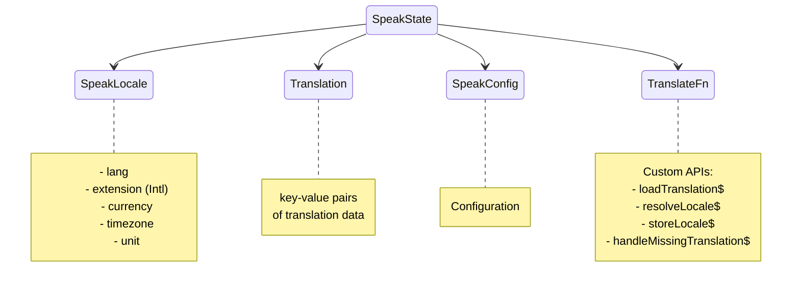

# Qwik Speak ⚡️
[](https://github.com/robisim74/qwik-speak/actions/workflows/node.js.yml) [](https://github.com/robisim74/qwik-speak/actions/workflows/playwright.yml)

> Internationalization (i18n) library to translate texts, dates and numbers in Qwik apps

Live example on [StackBlitz](https://stackblitz.com/edit/qwik-speak)

## Usage
```shell
npm install qwik-speak --save-dev
```
### Getting the translation
```jsx
import { $translate as t, plural as p } from 'qwik-speak';

export default component$(() => {
  return (
    <>
      <h1>{t('app.title')}</h1> {/* Qwik Speak */}
      <p>{t('home.greeting', { name: 'Qwik Speak' })}</p> {/* Hi! I am Qwik Speak */}
      <p>{p(state.count, 'runtime.devs')}</p> {/* 1 software developer, 2 software developers */}
    </>
  );
});
```
### Getting dates, relative time & numbers
```jsx
import { formatDate as fd, relativeTime as rt, formatNumber as fn } from 'qwik-speak';

export default component$(() => {
  return (
    <>
      <p>{fd(Date.now(), { dateStyle: 'full', timeStyle: 'short' })}</p> {/* Wednesday, July 20, 2022 at 7:09 AM */}
      <p>{rt(-1, 'second')}</p> {/* 1 second ago */}
      <p>{fn(1000000, { style: 'currency' })}</p> {/* $1,000,000.00 */}
    </>
  );
});
```
### Configuration
```typescript
import { SpeakConfig } from 'qwik-speak';

export const config: SpeakConfig = {
  defaultLocale: { lang: 'en-US', currency: 'USD', timeZone: 'America/Los_Angeles' },
  supportedLocales: [
    { lang: 'it-IT', currency: 'EUR', timeZone: 'Europe/Rome' },
    { lang: 'en-US', currency: 'USD', timeZone: 'America/Los_Angeles' }
  ],
  assets: [
    'app', // Translations shared by the pages
  ]
};
```
Assets will be loaded through the implementation of `loadTranslation$` function below. You can load _json_ files or call an _endpoint_ to return a `Translation` object of key-value pairs for each language:

```json
{
  "app": {
    "title": "Qwik Speak"
  }
}
```
#### Custom APIs
```typescript
import { $ } from '@builder.io/qwik';

export const loadTranslation$: LoadTranslationFn = $((lang: string, asset: string, url?: URL) => {
  /* Must contain the logic to load translation data */
  
  // E.g. Fetch translation data from json files in public dir or i18n/[lang]/[asset].json endpoint 
  let endpoint = '';
  // Absolute urls on server
  if (isServer && url) {
    endpoint = url.origin;
  }
  endpoint += `/i18n/${lang}/${asset}.json`;
  const data = await fetch(endpoint);
  return data.json();
});

export const resolveLocale$: ResolveLocaleFn = $((url?: URL) => {
  /* Must contain the logic to resolve which locale to use during SSR */
});

export const storeLocale$: StoreLocaleFn = $((locale: SpeakLocale) => {
  /* Must contain the logic to store the locale on client when changes */
});

export const handleMissingTranslation$: HandleMissingTranslationFn = $((key: string, value?: string, params?: any, ctx?: SpeakState) => {
  /* Must contain the logic to handle missing values at runtime: by default returns the key */
});

export const translateFn: TranslateFn = {
  loadTranslation$: loadTranslation$,
  /* other functions */
};
```

Add `QwikSpeak` component in `root.tsx`:
```jsx
import { QwikSpeak } from 'qwik-speak';

export default component$(() => {
  return (
    /**
     * Init Qwik Speak (only available in child components)
     */
    <QwikSpeak config={config} translateFn={translateFn}>
      <QwikCity>
        <head></head>
        <body>
          <RouterOutlet />
        </body>
      </QwikCity>
    </QwikSpeak>
  );
});
```
### Scoped translations

Create a different translation data file (asset) for each page and use `Speak` component to add translation data to the context:
```jsx
import { Speak } from 'qwik-speak';

export default component$(() => {
  return (
    /**
     * Add Home translations (only available in child components)
     */
    <Speak assets={['home']}>
      <Home />
    </Speak>
  );
});
```
### Additional languages
```jsx
import { Speak } from 'qwik-speak';

export default component$(() => {
  return (
    <Speak assets={['home']} langs={['en-US']}>
      <Home />
    </Speak>
  );
});
```
The translation data of the additional languages are preloaded along with the current language. They can be used as a fallback for missing values by implementing `handleMissingTranslation$`, or for multilingual pages.

### Localized routing
What you need:
- A `lang` parameter in the root, like:
  ```
  routes
  │   
  └───[...lang]
      │   index.html 
      │
      └───page
              index.html
  ```
- Handle the localized routing in `resolveLocale$` and `storeLocale$`

## Extraction of translations
To extract translations directly from the components, a command is available that automatically generates the files with the keys and default values.

See [Qwik Speak Extract](./tools/extract.md) for more information on how to use it.

## Production
You have three solutions:
- **Build as is**  Translation happens _at runtime_: translations are loaded during SSR or on client, and the lookup also happens at runtime as in development mode
- **Build using Qwik Speak Inline Vite plugin** Translation happens _at compile-time_: translations are loaded and inlined during the build (both in server file and in chunks sent to the browser)
- **Build using Qwik Speak Inline Vite plugin & runtime** Translation happens _at compile-time_ or _at runtime_ as needed: static translations are loaded and inlined during the build, while dynamic translations occur at runtime

See [Qwik Speak Inline Vite plugin](./tools/inline.md) for more information on how it works and how to use it.

The [sample app](./src/app) in this project uses a localized routing, _Qwik Speak Inline Vite plugin & runtime_ solution and implements SSG.

## Speak config
- `defaultLocale`
The default locale

- `supportedLocales`
Supported locales

- `assets`
An array of strings: each asset is passed to the `loadTranslation$` function to obtain data according to the language

- `keySeparator`
Separator of nested keys. Default is `.`

- `keyValueSeparator`
Key-value separator. Default is `@@`

  The default value of a key can be passed directly into the string: `t('app.title@@Qwik Speak')`

The `SpeakLocale` object contains the `lang`, in the format `language[-script][-region]`, where:
- `language`: ISO 639 two-letter or three-letter code
- `script`: ISO 15924 four-letter script code
- `region` ISO 3166 two-letter, uppercase code

and optionally contains:
- `extension` Language with Intl extensions, in the format `language[-script][-region][-extensions]` like `en-US-u-ca-gregory-nu-latn` to format dates and numbers
- `currency` ISO 4217 three-letter code
- `timezone` From the IANA time zone database
- `units` Key value pairs of unit identifiers

## APIs
### Functions
- `$translate(keys: string | string[], params?: any, ctx?: SpeakState, lang?: string)`
Translates a key or an array of keys. The syntax of the string is `key@@[default value]`

- `plural(value: number | string, prefix?: string, options?: Intl.PluralRulesOptions, ctx?: SpeakState, lang?: string)`
Gets the plural by a number

- `formatDate(value: Date | number | string, options?: Intl.DateTimeFormatOptions, locale?: SpeakLocale, lang?: string, timeZone?: string)`
Formats a date

- `relativeTime(value: number | string, unit: Intl.RelativeTimeFormatUnit, options?: Intl.RelativeTimeFormatOptions, locale?: SpeakLocale, lang?: string)`
Format a relative time

- `formatNumber(value: number | string, options?: Intl.NumberFormatOptions, locale?: SpeakLocale, lang?: string, currency?: string)`
Formats a number

- `changeLocale(newLocale: SpeakLocale, ctx: SpeakState)`
Changes locale at runtime: loads translation data and rerenders components that uses translations

### Speak context


- `useSpeakContext()`
Returns the Speak state

- `useSpeakLocale()`
Returns the locale in Speak context

- `useTranslation()`
Returns the translation data in Speak context

- `useSpeakConfig()`
Returns the configuration in Speak context

## Development Builds
### Build library & tools
```Shell
npm run build
```
### Test library & tools
```Shell
npm test
npm run test.e2e
```
### Run the sample app
```Shell
npm start
```
### Build the sample app
```Shell
npm run build.app
```
#### Express server
```Shell
npm run serve
```
#### Static Site Generation (SSG)
With an Express server running to provide http requests, execute in another Terminal:
```Shell
npm run ssg
```
and stop the Express server. Then serve the static app:

```Shell
npm run serve.ssg
```

## What's new
> Released v0.2.0

- Extract translations: [Qwik Speak Extract](./tools/extract.md) 
- Inline translation data at compile time: [Qwik Speak Inline Vite plugin](./tools/inline.md) 

## License
MIT
