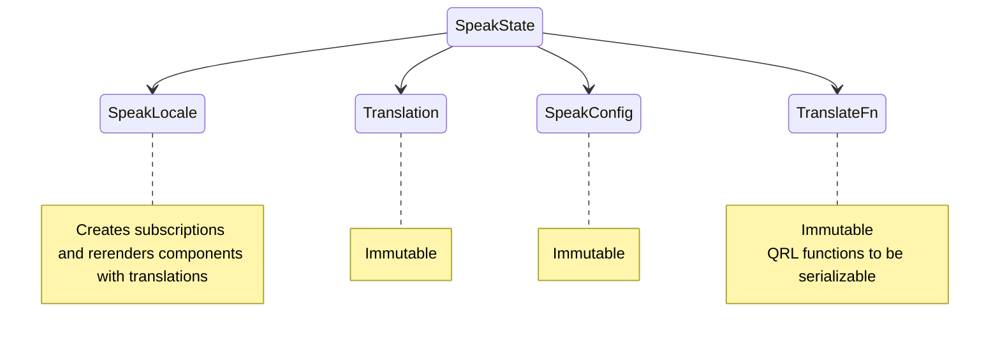
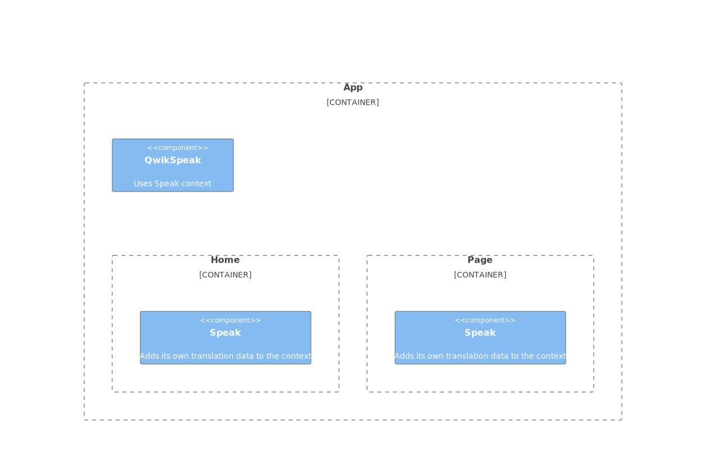

# Qwik Speak ⚡️
[](https://github.com/robisim74/qwik-speak/actions/workflows/node.js.yml) [](https://github.com/robisim74/qwik-speak/actions/workflows/playwright.yml)

> Internationalization (i18n) library to translate texts, dates and numbers in Qwik apps

Live example on [StackBlitz](https://stackblitz.com/edit/qwik-speak)

## Speak context


## Usage
<!---

-->


### Getting started
```shell
npm install qwik-speak --save-dev
```
### Getting the translation
```jsx
import { translate as t } from 'qwik-speak';

export default component$(() => {
  return (
    <>
      <h1>{t('app.title', { name: 'Qwik Speak' })}</h1> {/* I'm Qwik Speak */}
    </>
  );
});
```
### Getting dates & numbers
```jsx
import { formatDate as fd, formatNumber as fn } from 'qwik-speak';

export default component$(() => {
  return (
    <>
      <p>{fd(Date.now(), { dateStyle: 'full', timeStyle: 'short' })}</p> {/* Wednesday, July 20, 2022 at 7:09 AM */}
      <p>{fn(1000000, { style: 'currency' })}</p> {/* $1,000,000.00 */}
    </>
  );
});
```
### Configuration
```typescript
import { SpeakConfig, Translation } from 'qwik-speak';

export const appTranslation: Translation = {
  "en-US": {
    "app": {
      "title": "I'm {{name}}"
    }
  },
  "it-IT": {
    "app": {
      "title": "Io sono {{name}}"
    }
  }
};

export const config: SpeakConfig = {
  defaultLocale: { language: 'en-US', currency: 'USD', timeZone: 'America/Los_Angeles' },
  supportedLocales: [
    { language: 'it-IT', currency: 'EUR', timeZone: 'Europe/Rome' },
    { language: 'en-US', currency: 'USD', timeZone: 'America/Los_Angeles' }
  ],
  assets: [
    appTranslation
  ]
};
```
> Assets can be translation data, as in the example, or string paths to load json files or others types by implementing `getTranslation$` below
```jsx
// File: root.tsx
import { QwikSpeak } from 'qwik-speak';

export default component$(() => {
  return (
    <QwikCity>
      {/* Init Qwik Speak (only available in child components) */}
      <QwikSpeak config={config}>
        <Head />
        <body>
          <RouterOutlet />
        </body>
      </QwikSpeak>
    </QwikCity>
  );
});
```
### Adding translation data to a context
```jsx
import { Speak } from 'qwik-speak';

export default component$(() => {
  return (
    /**
     * Add Home translation (only available in child components)
     */
    <Speak assets={[homeTranslation]}>
      <Home />
    </Speak>
  );
});
```
### Additional languages
```jsx
import { Speak } from 'qwik-speak';

export default component$(() => {
  return (
    <Speak assets={[homeTranslation]} langs={['en-US']}>
      <Home />
    </Speak>
  );
});
```
> The translation data of the additional languages are preloaded along with the current language. They can be used as a fallback for missing values by implementing `handleMissingTranslation$` below, or for multilingual pages
### Hacking the library
```typescript
import { $ } from '@builder.io/qwik';

export const getTranslation$: GetTranslationFn = $((lang: string, asset: string | Translation, location?: RouteLocation) => {
  /* Must contain the logic to get translation data: by default it uses only an asset of Translation object */
});

export const resolveLocale$: ResolveLocaleFn = $((location?: RouteLocation, endpointData?: any) => {
  /* Must contain the logic to resolve which locale to use during SSR */
});

export const storeLocale$: StoreLocaleFn = $((locale: SpeakLocale) => {
  /* Must contain the logic to store the locale on Client when changes */
});

export const handleMissingTranslation$: HandleMissingTranslationFn = $((key: string, value?: string, params?: any, ctx?: SpeakState) => {
  /* Must contain the logic to handle missing values: by default returns the key */
});

export const translateFn: TranslateFn = {
  getTranslation$: getTranslation$,
  /* other functions */
};
```
```jsx
export default component$(() => {
  return (
    <QwikCity>
      {/* Init Qwik Speak with translation functions */}
      <QwikSpeak config={config} translateFn={translateFn}>
        <Head />
        <body>
          <RouterOutlet />
        </body>
      </QwikSpeak>
    </QwikCity>
  );
});
```
> Examples of these implementations can be found in the [app](https://github.com/robisim74/qwik-speak/tree/main/src/app)

## Speak config
- `defaultLocale`
The default locale

- `supportedLocales`
Supported locales

- `assets`
An array of string paths, or an array of _Translation_ objects: each asset is passed to the `getTranslation$` function to obtain data according to the language

- `keySeparator`
Separator of nested keys. Default is `.`

The `SpeakLocale` object contains the `lang`, in the format `language[-script][-region]`, where:
- _language_: ISO 639 two-letter or three-letter code
- _script_: ISO 15924 four-letter script code
- _region_: ISO 3166 two-letter, uppercase code

and optionally contains:
- `extension` Language with Intl extensions, in the format `language[-script][-region][-extensions]` like `en-US-u-ca-gregory-nu-latn` to format dates and numbers
- `currency` ISO 4217 three-letter code
- `timezone` From the IANA time zone database
- `units` Key value pairs of unit identifiers

## APIs
### Functions
- `translate(keys: string | string[], params?: any, ctx?: SpeakState, lang?: string)`
Translates a key or an array of keys

- `formatDate(value: any, options?: Intl.DateTimeFormatOptions, locale?: SpeakLocale, lang?: string, timeZone?: string)`
Formats a date

- `formatNumber(value: any, options?: Intl.NumberFormatOptions, locale?: SpeakLocale, lang?: string, currency?: string)`
Formats a number

- `changeLocale(newLocale: SpeakLocale, ctx: SpeakState)`
Changes locale at runtime: loads translation data and rerenders components that uses translations

### Speak context
- `useSpeakContext()`
Returns the Speak context

- `useSpeakLocale()`
Returns the locale in Speak context

- `useTranslation()`
Returns the translation data in Speak context

- `useSpeakConfig()`
Returns the configuration in Speak context

## Development Builds
### Run the app
```Shell
npm start
```
### Test the library
```Shell
npm test
npm run test.e2e
```

## Production Builds
```Shell
npm run build
```

## What's new
> Released v0.0.7

## License
MIT
