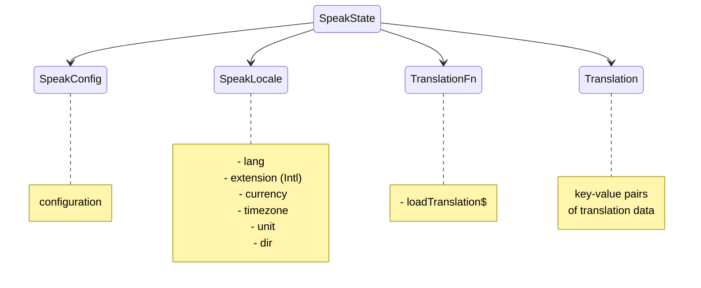

# Qwik Speak
[](https://github.com/robisim74/qwik-speak/actions/workflows/node.js.yml) [](https://github.com/robisim74/qwik-speak/actions/workflows/playwright.yml)

> Internationalization (i18n) library to translate texts, dates and numbers in Qwik apps

```shell
npm install qwik-speak --save-dev
```

## Getting Started
- [Quick Start](./docs/quick-start.md)
- [Tutorial: localized routing with prefix only](./docs/tutorial-routing.md)
- [Tutorial: localized routing with url rewriting](./docs/tutorial-routing-rewrite.md)
- [Translate](./docs/translate.md)
- [Translation functions](./docs/translation-functions.md)  
- [Qwik Speak and Adapters](./docs/adapters.md)
- [Testing](./docs/testing.md)

Live example on [Cloudflare pages](https://qwik-speak.pages.dev/) and playground on [CodeSandbox](https://codesandbox.io/p/github/robisim74/qwik-speak)

## Overview
### Getting the translation
```tsx
import { useTranslate } from 'qwik-speak';

export default component$(() => {
  const t = useTranslate();

  return (
    <>
      <h1>{t('app.title@@Qwik Speak')}</h1> {/* Qwik Speak */}
      <p>{t('home.greeting@@Hi! I am {{name}}', { name: 'Qwik Speak' })}</p> {/* Hi! I am Qwik Speak */}
    </>
  );
});
```
### Getting dates, relative time & numbers
```tsx
import { useFormatDate, useRelativeTime, useFormatNumber } from 'qwik-speak';

export default component$(() => {
  const fd = useFormatDate();
  const rt = useRelativeTime();
  const fn = useFormatNumber();

  return (
    <>
      <p>{fd(Date.now(), { dateStyle: 'full', timeStyle: 'short' })}</p> {/* Wednesday, July 20, 2022 at 7:09 AM */}
      <p>{rt(-1, 'second')}</p> {/* 1 second ago */}
      <p>{fn(1000000, { style: 'currency' })}</p> {/* $1,000,000.00 */}
    </>
  );
});
```

## Extraction of translations
To extract translations directly from the components, a command is available that automatically generates the files with the keys and default values.

See [Qwik Speak Extract](./docs/extract.md) for more information on how to use it.

## Automatic translation
To automatically translate files, an external command is available that uses OpenAI GPT Chat Completions API.

See [GPT Translate JSON](./docs/gpt-translate-json.md) for more information on how to use it.

## Production
In production, translations are loaded and inlined during the build.

See [Qwik Speak Inline Vite plugin](./docs/inline.md) for more information on how it works and how to use it.

## Speak context

> `SpeakState` is immutable: it cannot be updated after it is created and is not reactive

- `useSpeakContext()` Returns the Speak state
- `useSpeakConfig()` Returns the configuration in Speak context
- `useSpeakLocale()` Returns the locale in Speak context

### Speak config
- `defaultLocale` The default locale to use as fallback
- `supportedLocales` List of locales supported by the app
- `assets` Translation file names. Each asset is passed to the `loadTranslation$` function to obtain data according to the language
- `runtimeAssets` Assets available at runtime
- `keySeparator` Separator of nested keys. Default is `.`
- `keyValueSeparator` Key-value separator. Default is `@@`
- `rewriteRoutes` Rewrite routes as specified in Vite config for qwikCity

### SpeakLocale
The `SpeakLocale` object contains the `lang`, in the format `language[-script][-region]`, where:
- `language` ISO 639 two-letter or three-letter code
- `script` ISO 15924 four-letter script code
- `region` ISO 3166 two-letter, uppercase code

and optionally contains:
- `extension` Language with Intl extensions, in the format `language[-script][-region][-extensions]` like `en-US-u-ca-gregory-nu-latn` to format dates and numbers
- `currency` ISO 4217 three-letter code
- `timeZone` From the IANA time zone database
- `units` Key value pairs of unit identifiers
- `dir` Text direction: `'ltr' | 'rtl' | 'auto'`

### Translation functions
`TranslationFn` interface can be implemented to change the behavior of the library:
- `loadTranslation$` QRL function to load translation data

## APIs
### Components
#### QwikSpeakProvider component
`QwikSpeakProvider` component provides the Speak context to the app. `Props`:
  - `config` Speak config
  - `translationFn` Optional functions to use
  - `locale` Optional locale to use
  - `langs` Optional additional languages to preload data for (multilingual)

#### Speak component (scoped translations)
`Speak` component can be used for scoped translations. `Props`:
  - `assets` Assets to load
  - `runtimeAssets` Assets to load available at runtime
  - `langs` Optional additional languages to preload data for (multilingual)

### Functions
#### Translate
- `useTranslate: () => (keys: string | string[], params?: Record<string, any>, lang?: string)`
Translates a key or an array of keys. The syntax of the string is `key@@[default value]`

- `inlineTranslate(keys: string | string[], ctx: SpeakState, params?: Record<string, any>, lang?: string)`
Translates a key or an array of keys outside the `component$`. The syntax of the string is `key@@[default value]`

- `usePlural: () => (value: number | string, key?: string, params?: Record<string, any>, options?: Intl.PluralRulesOptions, lang?: string)`
Gets the plural by a number using [Intl.PluralRules](https://developer.mozilla.org/en-US/docs/Web/JavaScript/Reference/Global_Objects/Intl/PluralRules) API

- `useTranslatePath: () => (paths: string | string[], lang?: string)`
Translates a path or an array of paths. The translating string can be in any language. If not specified the target lang is the current one

#### Localize
- `useFormatDate: () => (value: Date | number | string, options?: Intl.DateTimeFormatOptions, lang?: string, timeZone?: string)`
Formats a date using [Intl.DateTimeFormat](https://developer.mozilla.org/en-US/docs/Web/JavaScript/Reference/Global_Objects/Intl/DateTimeFormat) API

- `useRelativeTime: () => (value: number | string, unit: Intl.RelativeTimeFormatUnit, options?: Intl.RelativeTimeFormatOptions, lang?: string)`
Formats a relative time using [Intl.RelativeTimeFormat](https://developer.mozilla.org/en-US/docs/Web/JavaScript/Reference/Global_Objects/Intl/RelativeTimeFormat) API

- `useFormatNumber: () => (value: number | string, options?: Intl.NumberFormatOptions, lang?: string, currency?: string)`
Formats a number using [Intl.NumberFormat](https://developer.mozilla.org/en-US/docs/Web/JavaScript/Reference/Global_Objects/Intl/NumberFormat) API

- `useDisplayName: () => (code: string, options: Intl.DisplayNamesOptions, lang?: string)`
Returns the translation of language, region, script or currency display names using [Intl.DisplayNames](https://developer.mozilla.org/en-US/docs/Web/JavaScript/Reference/Global_Objects/Intl/DisplayNames) API

## Development Builds
### Library & tools
#### Build
```shell
cd packages/qwik-speak
npm install
npm run build
```
#### Test
```shell
npm test
```
### Sample app
#### Run
```shell
npm install
npm start
```
#### Preview
```shell
npm run preview
```
#### Test
```shell
npm test
npm run test.e2e
```

## License
MIT
