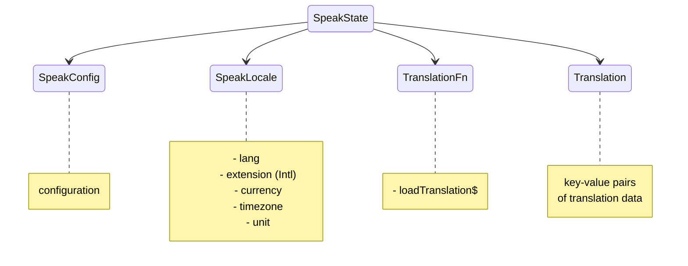

# Qwik Speak ⚡️
[](https://github.com/robisim74/qwik-speak/actions/workflows/node.js.yml) [](https://github.com/robisim74/qwik-speak/actions/workflows/playwright.yml)

> Internationalization (i18n) library to translate texts, dates and numbers in Qwik apps

```shell
npm install qwik-speak --save-dev
```

## Getting Started
- [Quick Start](./docs/quick-start.md)
- [Tutorial: localized routing](./docs/tutorial-routing.md)
- [Testing](./docs/testing.md)

Live example on [StackBlitz](https://stackblitz.com/edit/qwik-speak)

## Overview
### Getting the translation
```jsx
import { $translate as t, $plural as p } from 'qwik-speak';

export default component$(() => {
  return (
    <>
      <h1>{t('app.title')}</h1> {/* Qwik Speak */}
      <p>{t('home.greeting', { name: 'Qwik Speak' })}</p> {/* Hi! I am Qwik Speak */}
      <p>{p(state.count, 'home.devs')}</p> {/* 1 software developer, 2 software developers */}
    </>
  );
});
```
### Getting dates, relative time & numbers
```jsx
import { formatDate as fd, relativeTime as rt, formatNumber as fn } from 'qwik-speak';

export default component$(() => {
  return (
    <>
      <p>{fd(Date.now(), { dateStyle: 'full', timeStyle: 'short' })}</p> {/* Wednesday, July 20, 2022 at 7:09 AM */}
      <p>{rt(-1, 'second')}</p> {/* 1 second ago */}
      <p>{fn(1000000, { style: 'currency' })}</p> {/* $1,000,000.00 */}
    </>
  );
});
```

## Extraction of translations
To extract translations directly from the components, a command is available that automatically generates the files with the keys and default values.

See [Qwik Speak Extract](./tools/extract.md) for more information on how to use it.

## Production
You have three solutions:
- **Build as is**  Translation happens _at runtime_: translations are loaded during SSR or on client, and the lookup also happens at runtime as in development mode
- **Build using Qwik Speak Inline Vite plugin** Translation happens _at compile-time_: translations are loaded and inlined during the build (both in server file and in chunks sent to the browser)
- **Build using Qwik Speak Inline Vite plugin & runtime** Translation happens _at compile-time_ or _at runtime_ as needed: static translations are loaded and inlined during the build, while dynamic translations occur at runtime

See [Qwik Speak Inline Vite plugin](./tools/inline.md) for more information on how it works and how to use it.

## Speak context


- `useSpeakContext()` Returns the Speak state
- `useSpeakConfig()` Returns the configuration in Speak context
- `useSpeakLocale()` Returns the locale in Speak context

### Speak config
- `defaultLocale` The default locale to use as fallback
- `supportedLocales` Supported locales
- `assets` An array of strings: each asset is passed to the `loadTranslation$` function to obtain data according to the language
- `keySeparator` Separator of nested keys. Default is `.`
- `keyValueSeparator` Key-value separator. Default is `@@`. The default value of a key can be passed directly into the string: `t('app.title@@Qwik Speak')`

### SpeakLocale
The `SpeakLocale` object contains the `lang`, in the format `language[-script][-region]`, where:
- `language` ISO 639 two-letter or three-letter code
- `script` ISO 15924 four-letter script code
- `region` ISO 3166 two-letter, uppercase code

and optionally contains:
- `extension` Language with Intl extensions, in the format `language[-script][-region][-extensions]` like `en-US-u-ca-gregory-nu-latn` to format dates and numbers
- `currency` ISO 4217 three-letter code
- `timezone` From the IANA time zone database
- `units` Key value pairs of unit identifiers

### Translation functions
`TranslationFn` interface can be implemented to change the behavior of the library:
- `loadTranslation$?` Function to load translation data

## APIs
### Components

#### QwikSpeakProvider component
`QwikSpeakProvider` component provides the Speak context to the app. `Props`:
  - `config` Speak config
  - `translationFn` Optional functions to use
  - `locale` Optional locale to use
  - `langs` Optional additional languages to preload data for (multilingual)

#### Speak component (scoped translations)
`Speak` component can be used for scoped translations. `Props`:
  - `assets` Assets to load
  - `langs` Optional additional languages to preload data for (multilingual)

### Functions
- `$translate(keys: string | string[], params?: any, ctx?: SpeakState, lang?: string)`
Translates a key or an array of keys. The syntax of the string is `key@@[default value]`

- `$plural(value: number | string, prefix?: string, options?: Intl.PluralRulesOptions, ctx?: SpeakState, lang?: string)`
Gets the plural by a number

- `formatDate(value: Date | number | string, options?: Intl.DateTimeFormatOptions, locale?: SpeakLocale, lang?: string, timeZone?: string)`
Formats a date

- `relativeTime(value: number | string, unit: Intl.RelativeTimeFormatUnit, options?: Intl.RelativeTimeFormatOptions, locale?: SpeakLocale, lang?: string)`
Formats a relative time

- `formatNumber(value: number | string, options?: Intl.NumberFormatOptions, locale?: SpeakLocale, lang?: string, currency?: string)`
Formats a number

- `changeLocale(newLocale: SpeakLocale, ctx: SpeakState)`
Changes locale at runtime: loads translation data and rerenders components that uses translations

## Development Builds
### Library & tools
#### Build
```Shell
npm run build
```
#### Test
```Shell
npm test
```
### Sample app
#### Run
```Shell
npm start
```
#### Preview
```Shell
npm run preview
```
#### Test
```Shell
npm run test.e2e
```

## License
MIT
