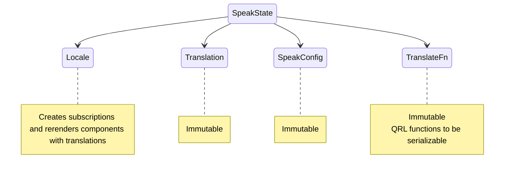
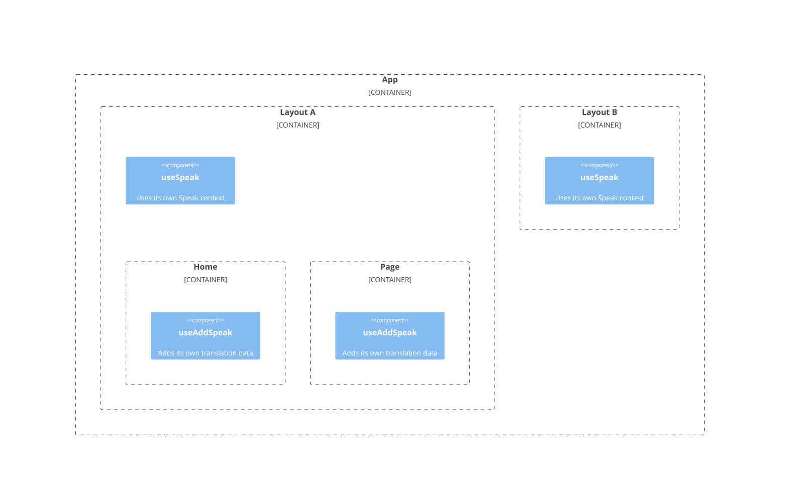

# Qwik Speak ⚡️
[](https://github.com/robisim74/qwik-speak/actions/workflows/node.js.yml) [](https://github.com/robisim74/qwik-speak/actions/workflows/playwright.yml)

> Internationalization (i18n) library to translate texts, dates and numbers in Qwik apps

Live example on [StackBlitz](https://stackblitz.com/edit/qwik-speak)

## Speak context


## Usage
<!---

-->


### Getting started
```shell
npm install qwik-speak --save-dev
```
### Getting the translation
```jsx
import { translate as t } from 'qwik-speak';

export default component$(() => {
    return (
        <Host>
            <h1>{t('app.title', { name: 'Qwik Speak' })}</h1> {/* I'm Qwik Speak */}
        </Host>
    );
});
```
### Configuration
```typescript
import { SpeakConfig, Translation } from 'qwik-speak';

export const appTranslation: Translation = {
    "en-US": {
        "app": {
            "title": "I'm {{name}}"
        }
    },
    "it-IT": {
        "app": {
            "title": "Io sono {{name}}"
        }
    }
};

export const config: SpeakConfig = {
    languageFormat: 'language-region',
    defaultLocale: { language: 'en-US', currency: 'USD', timeZone: 'America/Los_Angeles' },
    supportedLocales: [
        { language: 'it-IT', currency: 'EUR', timeZone: 'Europe/Rome' },
        { language: 'en-US', currency: 'USD', timeZone: 'America/Los_Angeles' }
    ],
    assets: [
        appTranslation
    ]
};
```

```jsx
// File: src/routes/_layout.tsx
import { useSpeak } from 'qwik-speak';

export default component$(() => {
    useSpeak(config); // Speak context will be available in child components

    return (
        <Host>
            <Header />
            <main>
                <Slot />
            </main>
        </Host >
    );
});
```
### Getting dates & numbers
```jsx
import { formatDate as fd } from 'qwik-speak';
import { formatNumber as fn } from 'qwik-speak';

export default component$(() => {
    return (
        <Host>
            <p>{fd(Date.now(), { dateStyle: 'full', timeStyle: 'short' })}</p> {/* Wednesday, July 20, 2022 at 7:09 AM */}
            <p>{fn(1000000, { style: 'currency' })}</p> {/* $1,000,000.00 */}
        </Host>
    );
});
```
### Add translation data to a context
```jsx
import { useAddSpeak } from 'qwik-speak';

export default component$(() => {
    useAddSpeak([homeTranslation]); // Translation will be available in child components

    return (
        <Host>
            <Home />
        </Host>
    );
});
```
### Hacking the library
```typescript
import { $ } from '@builder.io/qwik';

export const getTranslation$: GetTranslationFn = $((language: string, asset: string | Translation) => {
    /* Must contain the logic to get translation data: by default it uses only an asset of Translation object */
});

export const getUserLanguage$: GetUserLanguageFn = $(() => {
    /* Must contain the logic to get the user language */
});

export const setLocale$: SetLocaleFn = $((locale: Partial<Locale>) => {
    /* Must contain the logic to store the locale */
});

export const getLocale$: GetLocaleFn = $(() => {
    /* Must contain the logic to get the locale from the storage */
});

export const handleMissingTranslation$: HandleMissingTranslationFn = $((key: string, value?: string, params?: any) => {
    /* Must contain the logic to handle missing values: by default returns the key */
});

export const translateFn: TranslateFn = {
    getTranslation$: getTranslation$,
    /* other functions */
};
```
```jsx
export default component$(() => {
    useSpeak(config, translateFn); // Use Speak with config & translation functions

    return (
        <Host>
            <Header />
            <main>
                <Slot />
            </main>
        </Host >
    );
});
```

## Speak config
- `languageFormat`
The format of the _language_ to be used for translations. The supported formats are: `'language' | 'language-script' | 'language-region' | 'language-script-region'`. So, for example, you can have a _language_ like `en-US-u-ca-gregory-nu-latn` to format dates and numbers, but only use the `en-US` for translations

- `keySeparator`
Separator of nested keys. Default is `.`

- `defaultLocale`
The default locale to be used as fallback

- `supportedLocales`
Supported locales

- `assets`
An array of string paths, or an array of _Translation_ objects: each asset is passed to the _getTranslation$_ function to obtain data according to the language

The `Locale` object contains a _language_, in the format `language[-script][-region][-extension]`, where:
- language: ISO 639 two-letter or three-letter code
- script: ISO 15924 four-letter script code
- region: ISO 3166 two-letter, uppercase code
- extension: 'u' (Unicode) extensions

Optionally:
- _currency_: ISO 4217 three-letter code
- _timezone_: from the IANA time zone database
- _units_: key value pairs of unit identifiers

## APIs
- `useSpeak(config: SpeakConfig, translateFn?: TranslateFn)`
Creates a new Speak context, resolves the locale & loads translation data

- `useAddSpeak(assets: Array<string | Translation>, ctx?: SpeakState)`
Adds translation data to a Speak context

- `translate(keys: string | string[], params?: any, ctx?: SpeakState, language?: string)`
Translates a key or an array of keys

- `useTranslate()`
Returns the _translate_ function and the Speak context

- `formatDate(value: any, options?: Intl.DateTimeFormatOptions, ctx?: SpeakState, language?: string, timeZone?: string)`
Formats a date

- `useFormatDate()`
Returns the _formatDate_ function and the Speak context

- `formatNumber(value: any, options?: Intl.NumberFormatOptions, ctx?: SpeakState, language?: string, currency?: string)`
Formats a number

- `useFormatNumber()`
Returns the _formatNumber_ function and the Speak context

- `changeLocale()`
Changes the locale at runtime: loads translation data and rerenders components that uses translations

- `useChangeLocale()`
Returns the _changeLocale_ function and the Speak context

- `useLanguage()`
Returns the current language in config format

- `useLocale()`
Returns the current locale in Speak context

- `useTranslation()`
Returns the translation data in Speak context

- `useSpeakConfig()`
Returns the configuration in Speak context

## Development Builds
### Server-side Rendering (SSR) and Client
```Shell
npm start
```
### Test
```Shell
npm test
npm run test.e2e
```

## Production Builds
```Shell
npm run build
```

## What's new
> Released v0.0.2

## License
MIT
