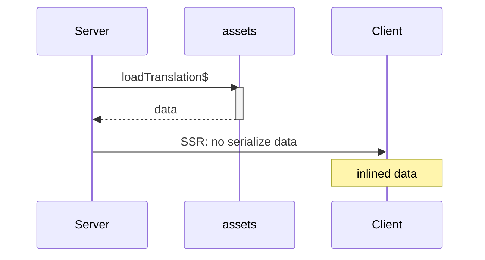

# Qwik Speak Inline Vite plugin

> Inline Qwik Speak `useTranslate`, `inlineTranslate` and `usePNrlural` functions at compile time

## How it works
In development mode, translation happens _at runtime_: `assets` are loaded during SSR or on client, and the lookup also happens at runtime.

In production mode, `assets` are loaded only during SSR, and to get the translations on the client as well you have to use _Qwik Speak Inline_ Vite plugin.

Using the _Qwik Speak Inline_, translation happens _at compile-time_: `assets` are loaded and inlined in chunks sent to the browser during the build, reducing resource usage at runtime:



## Usage
### Get the code ready
Qwik uses the `q:base` attribute to determine the base URL for loading the chunks in the browser, so you have to set it in `entry.ssr.tsx` file:
```typescript
export function extractBase({ serverData }: RenderOptions): string {
  if (!isDev && serverData?.locale) {
    return '/build/' + serverData.locale;
  } else {
    return '/build';
  }
}

export default function (opts: RenderToStreamOptions) {
  return renderToStream(<Root />, {
    manifest,
    ...opts,
    // Determine the base URL for the client code
    base: extractBase,
  });
}
```
### Configure
Add `qwikSpeakInline` Vite plugin in `vite.config.ts`:
```typescript
import { qwikSpeakInline } from 'qwik-speak/inline';

export default defineConfig(() => {
  return {
    plugins: [
      qwikCity(),
      qwikVite(),
      qwikSpeakInline({
        basePath: './',
        assetsPath: 'i18n',
        supportedLangs: ['en-US', 'it-IT'],
        defaultLang: 'en-US'
      }),
    ],
  };
});
```
and build the app:
```shell
npm run preview
```
The browser chunks are generated one for each language:
```
dist/build/
│   
└───en-US/
│       q-*.js
└───it-IT/
        q-*.js
```
Each contains only its own translation:

_dist/build/en-US/q-*.js_
```javascript
/* @__PURE__ */ Nr("h2", null, null, `Translate your Qwik apps into any language`, 1, null)
```
_dist/build/it-IT/q-*.js_
```javascript
/* @__PURE__ */ Nr("h2", null, null, `Traduci le tue app Qwik in qualsiasi lingua`, 1, null)
```

At the end of the build, in root folder a `qwik-speak-inline.log` file is generated which contains:
- Missing values
- Translations with dynamic keys
- Translations with dynamic params

> Note. Currently, only `json` files are supported as assets

## Qwik Speak Inline Vite plugin & runtime
When there are translations with dynamic keys or params, you have to use separate files, and add them to `runtimeAssets`:
  
```typescript
export const config: SpeakConfig = {
  /* ... */
  assets: [
    'app' // Translations shared by the pages
  ],
  runtimeAssets: [
    'runtime' // Translations with dynamic keys or parameters
  ]
};
```
Likewise, you can also create scoped runtime files for different pages and pass them to `Speak` components:
```tsx
export default component$(() => {
  return (
    <Speak assets={['home']} runtimeAssets={['runtimeHome']}>
      <Page />
    </Speak>
  );
});
```
> `runtimeAssets` are serialized and sent to the client, and loaded when required

