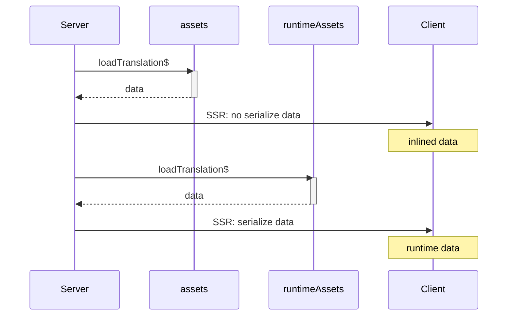

# Qwik Speak Inline Vite plugin

> Inline Qwik Speak `inlineTranslate` and `inlinePlural` functions at compile time

## How it works
On the server, translation happens _at runtime_: `assets` are loaded during SSR and the lookup also happens at runtime.

On the client, translation happens _at compile-time_: `assets` are loaded and inlined in chunks sent to the browser during the build, reducing resource usage at runtime.

`runtimeAssets` are always loaded at runtime, both on the server or on the client, allowing dynamic translations.



## Usage
### Get the code ready
Qwik uses the `q:base` attribute to determine the base URL for loading the chunks in the browser, so you have to set it in `entry.ssr.tsx` file:
```typescript
import { isDev } from '@builder.io/qwik/build';

export function extractBase({ serverData }: RenderOptions): string {
  if (!isDev && serverData?.locale) {
    return '/build/' + serverData.locale;
  } else {
    return '/build';
  }
}

export default function (opts: RenderToStreamOptions) {
  return renderToStream(<Root />, {
    manifest,
    ...opts,
    // Determine the base URL for the client code
    base: extractBase,
  });
}
```
> Note. The value set through Qwik `locale()` in `plugin.ts` is saved by Qwik in `serverData.locale` directly. Make sure the locale is among the `supportedLocales`

### Configure
Add `qwikSpeakInline` Vite plugin in `vite.config.ts`:
```typescript
import { qwikSpeakInline } from 'qwik-speak/inline';

export default defineConfig(() => {
  return {
    plugins: [
      qwikCity(),
      qwikVite(),
      qwikSpeakInline({
        basePath: './',
        assetsPath: 'i18n',
        supportedLangs: ['en-US', 'it-IT'],
        defaultLang: 'en-US'
      }),
    ],
  };
});
```
Available options:
- `supportedLangs` Supported langs. Required
- `defaultLang` Default lang. Required
- `basePath` The base path. Default to `'./'`
- `assetsPath` Path to translation files: `[basePath]/[assetsPath]/[lang]/*.json`. Default to `'i18n'`
- `outDir` The build output directory. Default to `'dist'`
- `loadAssets` Optional function to load asset by lang
- `autoKeys` Automatically handle keys for each string. Default is false
- `keySeparator` Separator of nested keys. Default is `'.'`
- `keyValueSeparator` Key-value separator. Default is `'@@'`

> Note. Currently, only `json` is supported as format

Now build the app:
```shell
npm run preview
```
The browser chunks are generated one for each language:
```
dist/build/
│   
└───en-US/
│       q-*.js
└───it-IT/
        q-*.js
```
Each contains only its own translation:

_dist/build/en-US/q-*.js_
```javascript
/* @__PURE__ */ Nr("h2", null, null, `Translate your Qwik apps into any language`, 1, null)
```
_dist/build/it-IT/q-*.js_
```javascript
/* @__PURE__ */ Nr("h2", null, null, `Traduci le tue app Qwik in qualsiasi lingua`, 1, null)
```

At the end of the build, in root folder a `qwik-speak-inline.log` file is generated which contains:
- Missing values
- Translations with dynamic keys or params

### Load assets
If you need to load translation data from an external source, such as a db, you can implement a custom function with this signature:

```typescript
(lang: string) => Promise<Translation>
```
For example:
```typescript
export const loadAssets = async (lang: string) => {
  const response = await fetch('https://...');
  return response.json();
};
```
and pass the function to `loadAssets` option:

```typescript
qwikSpeakInline({
  supportedLangs: ['en-US', 'it-IT'],
  defaultLang: 'en-US',
  loadAssets: loadAssets
}),
```
The function will be called during the build for each supported language, and must return all translations for that language.
