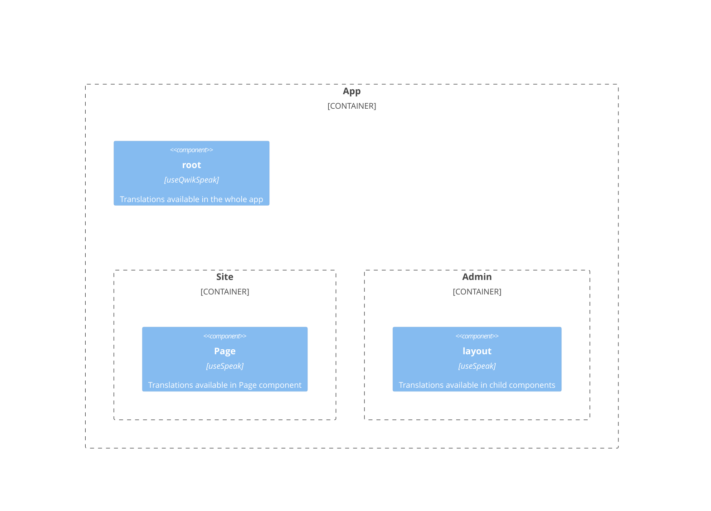

# Lazy loading translation

If you are developing a large app, you can consider using lazy loading translation: translations that are lazy loaded only when requested (when the user navigates to a specific section or page of the app):



For lazy loading of files in a specific section, you need to add `useSpeak` to the layout:
```tsx
import { useSpeak } from 'qwik-speak';

export default component$(() => {
  useSpeak({assets:['admin'], runtimeAssets: ['runtimeAdmin']});
  
  return (
    <>
      <main>
        <Slot />
      </main>
    </>
  );
});
```
or in a specific page:
```tsx
export default component$(() => {
  useSpeak({runtimeAssets: ['runtimePage']});

  return <Page />;
});
```
> Note that you must create a component for the page, because Qwik renders components in isolation, and translations are only available in child components